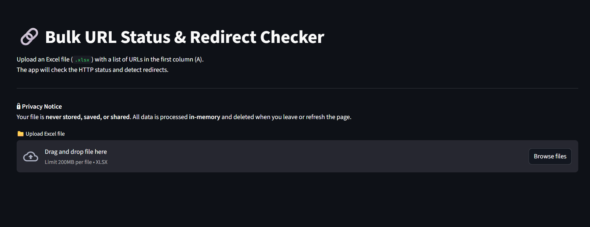

<!-- # Redirection_status_checker

Upload an Excel file with URLs in the first column. The app checks HTTP status and redirects.

Live Demo: https://redirectionstatuschecker-app.streamlit.app/ -->

<!--  -->

# 🔗 Bulk URL Status & Redirect Checker

A simple and powerful web-based tool built with [Streamlit](https://streamlit.io) that lets you check the HTTP status codes and redirection paths of multiple URLs at once.

---

## 🚀 Live Demo

[🔗 Launch the app](https://redirectionstatuschecker-app.streamlit.app/)  
(*Runs directly in your browser – no setup required!*)

---

## 🛠 Features

- ✅ Upload an Excel file with a list of URLs
- ✅ Or paste URLs manually into the app
- ✅ Detects:
  - HTTP status codes (200, 301, 302, 404, etc.)
  - Redirect targets and their status
- ✅ Download clean Excel report with all results
- ✅ User-friendly interface with no coding needed
- 🔒 No data stored — all processing is in memory and private

---

## 📁 Sample Input Format

If uploading an Excel file, it must follow this format:

| Original URL            |
|-------------------------|
| https://example.com     |
| https://abc.com     |

✅ Only **one column** with the header `Original URL`  
📥 [Download Sample Excel File](https://redirectionstatuschecker-app.streamlit.app/)

---